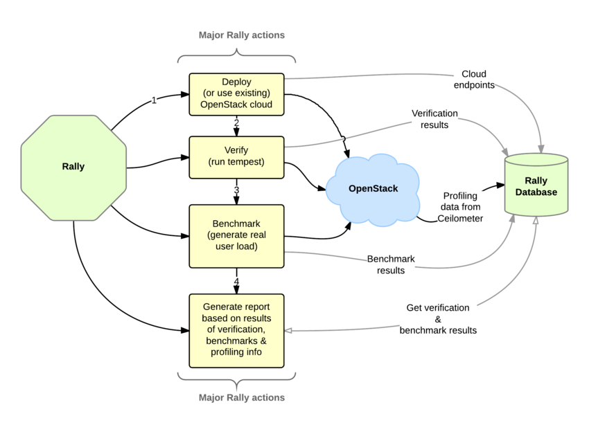

# puppet-rally

1. [基础知识](#基础知识)
2. [先睹为快 - 一言不合，立马动手?](#先睹为快)
3. [核心代码讲解 - 如何做到管理Rally服务？](#核心代码讲解)
    - [class rally](#class rally)
    - class rally::settings
4. [小结](#小结)
5. [动手练习 - 光看不练假把式](#动手练习)

**本节作者：余兴超**    
**阅读级别：选读 **  
**阅读时间: 40分钟**

##基础知识

`Rally`项目是Openstack性能测试服务，可以被用于Openstack CI/CD中的基本工具链中，以提高Openstack的SLA。下图给出了Rally与Deployment,Verify,Benchmark之间的关系以及其执行流程。不过Rally当前的主要工作仍然集中在benchmark上，社区的进度比较缓慢。


###架构简介
Openstack大多数项目属于as-a-service类型，因此Rally提供了service和CLI两种方式：

- Rally as-a-Service  以web service方式对外提供服务
- Rally as-an-App     作为轻量级命令行工具使用


##先睹为快


> puppet-rally模块目前没有使用Release机制管理，请使用master分支代码

在终端下执行以下命令:  
```
puppet apply -e 'include rally'
```

然后就可以开始使用rally了，是不是so easy？

##核心代码讲解

`puppet-rally`模块中，我们主要介绍`class rally`和`class rally::settings`：

###class rally

```puppet
  include ::rally::db   #配置数据库
  include ::rally::logging  #配置日志
  include ::rally::settings #rally.conf配置文件

  # Keep backward compatibility
  $openstack_client_http_timeout_real = pick($::rally::settings::openstack_client_http_timeout,$openstack_client_http_timeout)

  # rally软件包的安装
  package { 'rally':
    ensure => $ensure_package,
    name   => $::rally::params::package_name,
    tag    => ['openstack', 'rally-package'],
  }
  # 是否清理非Puppet管理的配置
  resources { 'rally_config':
    purge => $purge_config,
```

###class rally::settings

rally配置文件中涉及到各个服务的参数设置，以cinder为例，在[benchmark]下就有以下参数：

*   $volume_create_poll_interval 
*   $volume_create_prepoll_delay 
*   $volume_create_timeout       
*   $volume_delete_poll_interval 
*   $volume_delete_timeout

在`puppet-rally`模块下，将各服务的参数设置，拆为单独的class，放置在settings/目录下，统一被`rally::settings`调用：
```puppet
class rally::settings (
  $project_domain                = $::os_service_default,
  $resource_deletion_timeout     = $::os_service_default,
  $resource_management_workers   = $::os_service_default,
  $user_domain                   = $::os_service_default,
  $openstack_client_http_timeout = undef,
) {

  #管理rally各服务的配置
  include ::rally::settings::cinder
  include ::rally::settings::ec2
  include ::rally::settings::glance
  include ::rally::settings::heat
  include ::rally::settings::ironic
  include ::rally::settings::manila
  include ::rally::settings::murano
  include ::rally::settings::nova
  include ::rally::settings::sahara
  include ::rally::settings::swift
  # 此类等待https://review.openstack.org/#/c/337412/被Merge
  include ::rally::settings::tempest

  rally_config {
    'cleanup/resource_deletion_timeout':         value => $resource_deletion_timeout;
    'users_context/project_domain':              value => $project_domain;
    'users_context/resource_management_workers': value => $resource_management_workers;
    'users_context/user_domain':                 value => $user_domain;
  }
}
```


##小结

本节简要介绍了Rally服务以及如何使用`puppet-rally`模块部署Rally服务。当前，Rally服务作为Openstack平台的性能测试项目，目前的使用场景还是比较有限的，因为当前Rally只能支持API级别的性能测试，并且多数API的后端操作是异步的，如果只关注API的响应结果，意义不大。不过值得庆幸的是，Rally项目有来自国内两家公司的[core reviewer](https://review.openstack.org/#/admin/groups/211,members)（Kun Huang和Li Yingjun），我们期待着Newton版本中Rally的发展和变化。


##动手练习

1. 设置glance_image_create_timeout为60s
2. 使用MySQL替换默认的SQlite作为数据库后端
3. 当前`puppet-rally`能否支持从源码安装Rally？需要如何修改？


