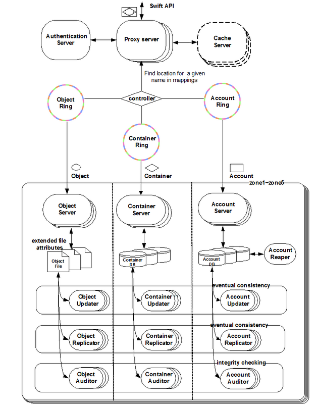

# puppet-swift

1. [先睹为快 - 一言不合，立马动手?](#先睹为快)
2. [核心代码讲解 - 如何做到管理swift服务？](#核心代码讲解)
    - [class swift](##class swift)
    - [class swift::proxy](##class swift::proxy)
    - [class swift::storage](##class swift::storage)
    - [class swift::keystone::auth](##class swift::keystone::auth)
    - [class swift::ringbuilder](##class swift::ringbuilder)
    - [class swift::ringserver](##class swift::ringserver)
    - [class swift::deps](##class swift::dips)
3. [小结](#小结)
4. [动手练习 - 光看不练假把式](#动手练习)

**本节作者：陆源**  
**阅读时间: 2小时**

## 基础知识
### swift介绍
Swift 最初是由 Rackspace 公司开发的高可用分布式对象存储服务，并于 2010 年贡献给 OpenStack 开源社区作为其最初的核心子>项目之一，为其 Nova 子项目提供虚机镜像存储服务。Swift 构筑在比较便宜的标准硬件存储基础设施之上，无需采用 RAID（磁盘冗余阵列），通过在软件层面引入一致性散列技术和数据冗余性，牺牲一定程度的数据一致性来达到高可用性和可伸缩性，支持多租户>模式、容器和对象读写操作，适合解决互联网的应用场景下非结构化数据存储问题。
### swift概念
账户（Account）:这里账户不是账号和密码的概念，可以理解为存储区域（Storage area）。
容器（container）:容器有自己的metadata，包含了一组object。
对象（object）:包含具体数据和metadata。
集群（cluster）:表示一个Swift存储集群。
区域（region）:表示一个集群中物理隔离的部分。
区（zone）:表示物理隔离的节点，可用于控制故障域。
节点（node）:表示运行Swift进程的物理服务器。
### swift架构图

### swift的组件介绍
| 名称 | 说明 |
|--------|:-----:|
|代理服务（swift-proxy-server）|对外提供对象服务 API，会根据环的信息来查找服务地址并转发用户请求至相应的账户、容器或者对象服务；由于采用无状态的 REST 请求协议，可以进行横向扩展来均衡负载。|
|认证服务（Authentication Server）|验证访问用户的身份信息，并获得一个对象访问令牌（Token），在一定的时间内会一直有效；验证访问令牌的有效性并缓存下来直至过期时间。|
|缓存服务（Cache Server）|缓存的内容包括对象服务令牌，账户和容器的存在信息，但不会缓存对象本身的数据；缓存服务可采用 Memcached 集群，Swift 会使用一致性散列算法来分配缓存地址。|
|账户服务（openstack-swift-account）|提供账户元数据和统计信息，并维护所含容器列表的服务，每个账户的信息被存储在一个 SQLite 数据库中。|
|容器服务（openstack-swift-container）|提供容器元数据和统计信息，并维护所含对象列表的服务，每个容器的信息也存储在一个 SQLite 数据库中。|
|对象服务（openstack-swift-object）|提供对象元数据和内容服务，每个对象的内容会以文件的形式存储在文件系统中，元数据会作为文件属性来存储，建议采用支持扩展属性的 XFS 文件系统。|
|复制服务（openstack-swift-replicator）|会检测本地分区副本和远程副本是否一致，具体是通过对比散列文件和高级水印来完成，发现不一致时会采用推式（Push）更新远程副本，例如对象复制服务会使用远程文件拷贝工具 rsync 来同步；另外一个任务是确保被标记删除的对象从文件系统中移除。|
|更新服务（openstack-swift-updater）|当对象由于高负载的原因而无法立即更新时，任务将会被序列化到在本地文件系统中进行排队，以便服务恢复后进行异步更新；例如成功创建对象后容器服务器没有及时更新对象列表，这个时候容器的更新操作就会进入排队中，更新服务会在系统恢复正常后扫描队列并进行相应的更新处理。|
|审计服务（openstack-swift-auditor）|检查对象，容器和账户的完整性，如果发现比特级的错误，文件将被隔离，并复制其他的副本以覆盖本地损坏的副本；其他类型的错误会被记录到日志中。|
|账户清理服务（openstack-swift-account-reaper）|移除被标记为删除的账户，删除其所包含的所有容器和对象。|

## 先睹为快
swift服务比较独立，可使用all-in-one部署，那么咱们先部署一套实验环境吧。
编写learn_swift.pp
```puppet

# This example file is almost the
# can be used to build out a sample swift all in one environment
#
$swift_local_net_ip='127.0.0.1'

$swift_shared_secret='changeme'

Exec { logoutput => true }

package { 'curl': ensure => present }


class { '::memcached':
  listen_ip => $swift_local_net_ip,
}

class { '::swift':
  # not sure how I want to deal with this shared secret
  swift_hash_suffix => $swift_shared_secret,
  package_ensure    => latest,
}

# === Configure Storage

class { '::swift::storage':
  storage_local_net_ip => $swift_local_net_ip,
}

# create xfs partitions on a loopback device and mounts them
swift::storage::loopback { '2':
  require => Class['swift'],
}

# sets up storage nodes which is composed of a single
# device that contains an endpoint for an object, account, and container

swift::storage::node { '2':
  mnt_base_dir         => '/srv/node',
  weight               => 1,
  manage_ring          => true,
  zone                 => '2',
  storage_local_net_ip => $swift_local_net_ip,
  require              => Swift::Storage::Loopback[2] ,
}

class { '::swift::ringbuilder':
  part_power     => '18',
  replicas       => '1',
  min_part_hours => 1,
  require        => Class['swift'],
}


# TODO should I enable swath in the default config?
class { '::swift::proxy':
  proxy_local_net_ip => $swift_local_net_ip,
  pipeline           => ['healthcheck', 'cache', 'tempauth', 'proxy-server'],
  account_autocreate => true,
  require            => Class['swift::ringbuilder'],
}
class { ['::swift::proxy::healthcheck', '::swift::proxy::cache']: }

class { '::swift::proxy::tempauth':
  account_user_list => [
    {
      'user'    => 'admin',
      'account' => 'admin',
      'key'     => 'admin',
      'groups'  => [ 'admin', 'reseller_admin' ],
    },
    {
      'user'    => 'tester',
      'account' => 'test',
      'key'     => 'testing',
      'groups'  => ['admin'],
    },
    {
      'user'    => 'tester2',
      'account' => 'test2',
      'key'     => 'testing2',
      'groups'  => ['admin'],
    },
    {
      'user'    => 'tester',
      'account' => 'test',
      'key'     => 'testing3',
      'groups'  => [],
    },
  ]
}
```
在终端执行以下命令:
```bash
puppet apply -v learn_swift.pp
```
## 核心代码讲解
### Class swift
此类的工作：
* 安装swift的软件包
* 配置swift的核心参数
* 此模块中由一个swift的class，下面分别由：条件判断语句、package资源、file资源、user资源、元参数组成。
```puppet
class swift(
  $swift_hash_path_suffix = undef,
  $swift_hash_path_prefix = undef,
  $package_ensure         = 'present',
  $client_package_ensure  = 'present',
  $max_header_size        = '8192',
) {

  include ::swift::deps
  include ::swift::params

  if ($swift_hash_path_prefix == undef and $swift_hash_path_suffix == undef) {
    fail('You must specify at least swift_hash_path_prefix or swift_hash_path_suffix')
  }

  if !defined(Package['swift']) {
    package { 'swift':
      ensure => $package_ensure,
      name   => $::swift::params::package_name,
      tag    => ['openstack', 'swift-package'],
    }
  }

  class { '::swift::client':
    ensure => $client_package_ensure;
  }

  File {
    owner   => 'swift',
    group   => 'swift',
    tag     => 'swift-file',
  }

  file { '/etc/swift':
    ensure => directory,
  }
  user {'swift':
    ensure  => present,
    require => Package['swift'],
  }
  file { '/var/lib/swift':
    ensure => directory,
  }
  file { '/var/run/swift':
    ensure                  => directory,
    selinux_ignore_defaults => true,
  }

  file { '/etc/swift/swift.conf':
    ensure => file,
  }

  File['/etc/swift/swift.conf'] -> Swift_config<||>

  swift_config {
    'swift-hash/swift_hash_path_suffix': value => $swift_hash_path_suffix;
    'swift-hash/swift_hash_path_prefix': value => $swift_hash_path_prefix;
    'swift-constraints/max_header_size': value => $max_header_size;
  }
}
```
*tag: 资源、类和自定义define有时会出现一个tag的属性，tag的主要用途：收集资源、分析报告、 Restricting catalog runs

### class swift::proxy
此类的工作：
*配置swift-proxy中配置文件，收集所有关于配置的资源后通知当前服务刷新。
*使用validate_[type]函数验证数据类型是否正确。（强烈推荐使用）
```puppet
class swift::proxy(
  $proxy_local_net_ip,
  $port                      = '8080',
  $pipeline                  = ['healthcheck', 'cache', 'tempauth', 'proxy-server'],
  $workers                   = $::processorcount,
  $allow_account_management  = true,
  $account_autocreate        = true,
  $log_headers               = 'False',
  $log_udp_host              = undef,
  $log_udp_port              = undef,
  $log_address               = '/dev/log',
  $log_level                 = 'INFO',
  $log_facility              = 'LOG_LOCAL1',
  $log_handoffs              = true,
  $log_name                  = 'proxy-server',
  $read_affinity             = undef,
  $write_affinity            = undef,
  $write_affinity_node_count = undef,
  $node_timeout              = undef,
  $manage_service            = true,
  $enabled                   = true,
  $package_ensure            = 'present',
  $service_provider          = $::swift::params::service_provider
) inherits ::swift::params {

  Swift_config<| |> ~> Service['swift-proxy-server']


  validate_bool($account_autocreate)
  validate_bool($allow_account_management)
  validate_array($pipeline)

  if($write_affinity_node_count and ! $write_affinity) {
    fail('Usage of write_affinity_node_count requires write_affinity to be set')
  }

  if(member($pipeline, 'tempauth')) {
    $auth_type = 'tempauth'
  } elsif(member($pipeline, 'swauth')) {
    $auth_type = 'swauth'
  } elsif(member($pipeline, 'keystone')) {
    $auth_type = 'keystone'
  } else {
    warning('no auth type provided in the pipeline')
  }

  if(! member($pipeline, 'proxy-server')) {
    warning('pipeline parameter must contain proxy-server')
  }

  if($auth_type == 'tempauth' and ! $account_autocreate ){
    fail('account_autocreate must be set to true when auth_type is tempauth')
  }

  if ($log_udp_port and !$log_udp_host) {
    fail ('log_udp_port requires log_udp_host to be set')
  }

  package { 'swift-proxy':
    ensure => $package_ensure,
    name   => $::swift::params::proxy_package_name,
    tag    => ['openstack', 'swift-package'],
  }

  concat { '/etc/swift/proxy-server.conf':
    owner   => 'swift',
    group   => 'swift',
    require => Package['swift-proxy'],
  }

  $required_classes = split(
    inline_template(
      "<%=
          (@pipeline - ['proxy-server']).collect do |x|
            'swift::proxy::' + x.gsub(/-/){ %q(_) }
          end.join(',')
      %>"), ',')
  concat::fragment { 'swift_proxy':
    target  => '/etc/swift/proxy-server.conf',
    content => template('swift/proxy-server.conf.erb'),
    order   => '00',
    before  => Class[$required_classes],
  }

  Concat['/etc/swift/proxy-server.conf'] -> Swift_proxy_config <||>

  if $manage_service {
    if $enabled {
      $service_ensure = 'running'
    } else {
      $service_ensure = 'stopped'
    }
  }

  swift::service { 'swift-proxy-server':
    os_family_service_name => $::swift::params::proxy_server_service_name,
    service_ensure         => $service_ensure,
    enabled                => $enabled,
    config_file_name       => 'proxy-server.conf',
    service_provider       => $service_provider,
    subscribe              => Concat['/etc/swift/proxy-server.conf'],
  }
}
```
### class swift::storage
此类的工作：
* 配置存储节点，account、container、object服务，并且将其启动。
* 配置存储节点，当前节点使用什么磁盘类型，并通过磁盘类型进行格式化，最后将磁盘挂载。

### swift::keystone::auth
此类的工作：
这个类主要是在keystone中创建swift服务的users,services,endpoints,roles
 
### swift::ringbuilder
此类的工作：
* 生成ring文件
* 生成ring文件后，将ring文件将存储文件和目录添加到ring中
* 对ring进行rebalance操作
```puppet
class swift::ringbuilder(
  $part_power = undef,
  $replicas = undef,
  $min_part_hours = undef
) {

  include ::swift::deps
  Class['swift'] -> Class['swift::ringbuilder']

  swift::ringbuilder::create{ ['object', 'account', 'container']:
    part_power     => $part_power,
    replicas       => $replicas,
    min_part_hours => $min_part_hours,
  }

  Swift::Ringbuilder::Create['object'] -> Ring_object_device <| |> ~> Swift::Ringbuilder::Rebalance['object']

  Swift::Ringbuilder::Create['container'] -> Ring_container_device <| |> ~> Swift::Ringbuilder::Rebalance['container']

  Swift::Ringbuilder::Create['account'] -> Ring_account_device <| |> ~> Swift::Ringbuilder::Rebalance['account']

  swift::ringbuilder::rebalance{ ['object', 'account', 'container']: }
```

### swift::ringserver
此类的工作：
* 通过创建一个rsync服务器来启动一个ringdatabase服务

### swift::deps
deps这个类是很重要，原因在于模块中有很多类通过”include ::xxxx”调用。在deps中，咱们大量使用”anchor”、”~>”、“->”等一些奇怪符号来排列资源的运行顺序，那么这些东西是何物？
* ~>：用于定义通知链
* ->：用于定义次序链
* anchor:它是Puppet的内置资源类型，当一个class声明另外一个class时,被声明的class的资源将不会被外部的这个类所包含，这使得我们不可能通过一些简单的小class文件组成一个复杂功能的module。为了解决这个问题，引入了anchor。
* anchor具体文档位置：https://docs.puppet.com/puppet/latest/reference/lang_containment.html
## 小结
本章咱们介绍了swift的相关概念，通过一个小列子来部署一套all-in-one的swift环境，并且讲解了puppet-swift相关核心代码中的一些小知识点。
## 动手练习
如何部署一个多节点的swift的集群？要求一个API节点，一个Stoage节点。
