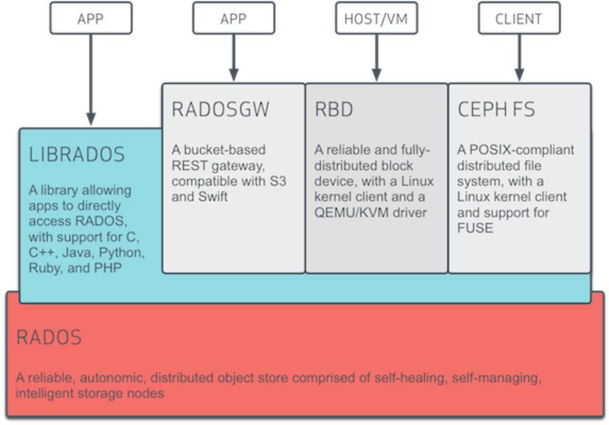
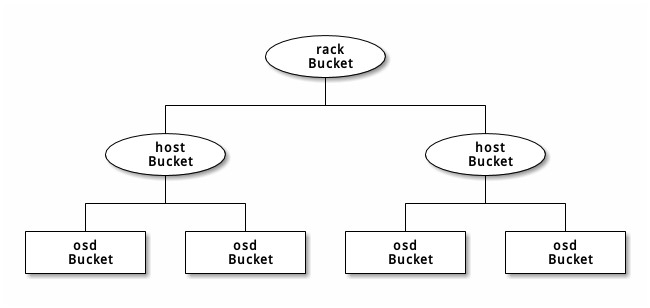

# puppet-ceph

1. [Ceph基本结构](#Ceph基本结构)
2. [Ceph基本组件](#Ceph基本组件)
3. [CRUSH机制](#CRUSH机制)
4. [puppet-ceph部署](#puppet-ceph部署)
5. [puppet执行过程分析](#puppet执行过程分析)
6. [小结](##小结)
7. [动手练习 - 光看不练假把式](##动手练习)

**本节作者：薛飞扬**

**建议阅读时间 2小时**

Ceph是一个分布式存储系统，诞生于2004年，是最早致力于开发下一代高性能分布式文件系统的项目。随着云计算的发展，ceph乘上了OpenStack的春风，进而成为了开源社区受关注较高的项目之一。


## Ceph基本结构



自下向上，可以将Ceph系统分为四个层次:

1.基础存储系统RADOS（Reliable, Autonomic, Distributed Object Store，即可靠的、自动化的、分布式的对象存储）
RADOS本身也是分布式存储系统，CEPH所有的存储功能都是基于RADOS实现,RADOS由大量的存储设备节点组成，每个节点拥有自己的硬件资源（CPU、内存、硬盘、网络），并运行着操作系统和文件系统。

2.基础库librados
这一层的功能是对RADOS进行抽象和封装，并向上层提供API，以便直接基于RADOS（而不是整个Ceph）进行应用开发。

3.高层应用接口
这一层包括了三个部分：RADOS GW（RADOS Gateway）、 RBD（Reliable Block Device）和Ceph FS（Ceph File System），其作用是在librados库的基础上提供抽象层次更高、更便于应用或客户端使用的上层接口。
其中，RADOS GW是一个提供与Amazon S3和Swift兼容的RESTful API的gateway，以供相应的对象存储应用开发使用。RADOS GW提供的API抽象层次更高，但功能则不如librados强大。因此，开发者应针对自己的需求选择使用。
RBD则提供了一个标准的块设备接口，常用于在虚拟化的场景下为虚拟机创建volume。目前，Red Hat已经将RBD驱动集成在KVM/QEMU中，以提高虚拟机访问性能。
Ceph FS是一个POSIX兼容的分布式文件系统。由于还处在开发状态，因而Ceph官网并不推荐将其用于生产环境中

4.应用层
这一层就是不同场景下对于Ceph各个应用接口的各种应用方式，例如基于librados直接开发的对象存储应用，基于RADOS GW开发的对象存储应用，基于RBD实现的云硬盘等等。

## Ceph基本组件

* Osd
用于集群中所有数据与对象的存储。处理集群数据的复制、恢复、回填、再均衡。并向其他osd守护进程发送心跳，然后向Mon提供一些监控信息。
* Monitor
监控整个集群的状态，维护集群的cluster MAP二进制表，保证集群数据的一致性。ClusterMAP描述了对象块存储的物理位置，以及一个将设备聚合到物理位置的桶列表。
* MDS(可选)
为Ceph文件系统提供元数据计算、缓存与同步。在ceph中，元数据也是存储在osd节点中的，mds类似于元数据的代理缓存服务器。MDS进程并不是必须的进程，只有需要使用CEPHFS>时，才需要配置MDS节点。

## CRUSH机制
### 引入CRUSH的目的
为了去中心化，避免单点故障，Ceph使用了CRUSH（Controlled Replication Under Scalable Hashing）算法，客户端根据它来计算数据被写到哪里去，以及从哪里读取所需数据。

### 理解CRUSH机制
对Ceph集群的一个读写操作，客户端首先访问Ceph monitor来获取cluster map 的一分副本，它包含五个map,分别是monitor map、OSD map 、 MDS map、CRUSH map 和PG map.

客户端通过这些cluster map知晓Ceph集群的状态和配置。通过CRUSH算法计算出或获取数据的主（primary）、次（secondary）和再次（tertiary）OSD的位置。

所有这些计算操作都是在客户端完成的，因此它们不会影响Ceph集群服务器端的性能。

每个map的简介如下：

* monitor map: 它包含监视节点端到端的信息，包括Ceph集群ID、monitor节点名称（hostname）、IP地址和端口号等。它还保存自monitor map被创建以来的最新版本号（epoch:每种map都维护着其历史版本，每个版本被称为一个epoch，epoch是一个单调递增的序号），以及最后修改时间等。  
查看monitor map 命令: ceph mon dump
* OSD map: 它保存一些常用的信息，包括集群ID、OSD map自创建以来的最新版本号（epoch）及其最后修改时间，以及存储池相关的信息，包括存储池名称、ID、类型、副本级别（replication level）和PG。它还保存着OSD的信息，比如数量、状态、权重、最后清理间隔（last clean interval）以及OSD节点的信息。  
查看OSD map命令：ceph osd dump
* PG map:它保存的信息包括PG的版本、时间戳、OSD map的最新版本号（epoch）、容量已满百分比，容量将满百分比等。它还记录了每个PG的ID、对象数量、状态、状态时间戳、up OSD sets、acting OSD sets,以及清理的信息。  
查看PG map 命令: ceph pg dump
* CRUSH map: 它保存的信息包括集群设备列表、bucket列表、故障域分层结构、故障域定义的规则等。  
查看CRUSH map 命令: ceph osd crush dump
* MDS map:它保存的信息包括MDS map当前版本号（epoch）、MDS map的创建和修改时间、数据和元数据存储池的ID、集群MDS数量以及MDS状态。  
查看MDS map 命令: ceph mds dump

### CRUSH Map的内容
CRUSH算法通过计算数据存储位置来确定如何存储和检索。 CRUSH 授权 Ceph 客户端直接连接 OSD ，而非通过一个中央服务器或经纪人。数据存储、检索算法的使用，使 Ceph 避免了单点故障、性能瓶颈、和伸缩的物理限制。

CRUSH图包含 OSD 列表、把设备汇聚为物理位置的“桶”列表和指示 CRUSH 如何复制存储池里的数据的规则列表。

CRUSH图主要有 4 个主要段落：

1.设备  
设备的格式：

```
#devices
device {num} {osd.name}
```

2.桶类型： 定义了 CRUSH 分级结构里要用的桶类型（ types ）
如：

```
# types
type 0 osd
type 1 host
type 2 chassis
type 3 rack
type 4 row
type 5 pdu
type 6 pod
type 7 room
type 8 datacenter
type 9 region
type 10 root
```

3.桶例程： 定义了桶类型后，还必须声明主机的桶类型、以及规划的其它故障域。
格式：

```
[bucket-type] [bucket-name] {
        id [a unique negative numeric ID]
        weight [the relative capacity/capability of the item(s)]
        alg [the bucket type: uniform | list | tree | straw ]
        hash [the hash type: 0 by default]
        item [item-name] weight [weight]
}
```

Ceph 支持四种桶，每种都是性能和组织简易间的折衷。如果你不确定用哪种桶，我们建议 straw 。关于桶类型的详细讨论请参考http://docs.ceph.org.cn/rados/operations/crush-map

各个桶都用了一种哈希算法，当前 Ceph 仅支持 rjenkins1 ，输入 0 表示哈希算法设置为 rjenkins1 。

例子如下：



定义的桶例程为：

```
host node1 {
        id -1
        alg straw
        hash 0
        item osd.0 weight 1.00
        item osd.1 weight 1.00
}

host node2 {
        id -2
        alg straw
        hash 0
        item osd.2 weight 1.00
        item osd.3 weight 1.00
}

rack rack1 {
        id -3
        alg straw
        hash 0
        item node1 weight 2.00
        item node2 weight 2.00
}
```
此例中，机柜桶不包含任何 OSD ，它只包含低一级的主机桶、以及其内条目的权重之和

4.规则： 由选择桶的方法组成。

规则格式如下：

```
rule <rulename> {

        ruleset <ruleset>
        type [ replicated | erasure ]
        min_size <min-size>
        max_size <max-size>
        step take <bucket-type>
        step [choose|chooseleaf] [firstn|indep] <N> <bucket-type>
        step emit
}

```
各字段含义如下:

4.1ruleset

&emsp;&emsp;描述:   区分一条规则属于某个规则集的手段。给存储池设置规则集后激活。  
&emsp;&emsp;目的:   规则掩码的一个组件。  
&emsp;&emsp;类型:   Integer  
&emsp;&emsp;是否必需:   Yes  
&emsp;&emsp;默认值: 0  

4.2type

&emsp;&emsp;描述:   为硬盘（复制的）或 RAID 写一条规则。  
&emsp;&emsp;目的:   规则掩码的一个组件。  
&emsp;&emsp;类型:   String  
&emsp;&emsp;是否必需:   Yes  
&emsp;&emsp;默认值: replicated  
&emsp;&emsp;合法取值:   当前仅支持 replicated 和 erasure

4.3min_size

&emsp;&emsp;描述:   如果一个归置组副本数小于此数， CRUSH 将不应用此规则。  
&emsp;&emsp;类型:   Integer  
&emsp;&emsp;目的:   规则掩码的一个组件。  
&emsp;&emsp;是否必需:   Yes  
&emsp;&emsp;默认值: 1

4.4max_size

&emsp;&emsp;描述:   如果一个归置组副本数大于此数， CRUSH 将不应用此规则。  
&emsp;&emsp;类型:   Integer  
&emsp;&emsp;目的:   规则掩码的一个组件。  
&emsp;&emsp;是否必需:   Yes  
&emsp;&emsp;默认值: 10

4.5step take <bucket-name>

&emsp;&emsp;描述:   选取桶名并迭代到树底。  
&emsp;&emsp;目的:   规则掩码的一个组件。  
&emsp;&emsp;是否必需:   Yes  
&emsp;&emsp;实例:   step take default

4.6step choose firstn {num} type {bucket-type}

&emsp;&emsp;描述:   选取指定类型桶的数量，这个数字通常是存储池的副本数（即 pool size ）。  
&emsp;&emsp;&emsp;&emsp;如果 {num} == 0 选择 pool-num-replicas 个桶（所有可用的）；  
&emsp;&emsp;&emsp;&emsp;如果 {num} > 0 && < pool-num-replicas 就选择那么多的桶；  
&emsp;&emsp;&emsp;&emsp;如果 {num} < 0 它意为 pool-num-replicas - {num} 。  
&emsp;&emsp;目的:	规则掩码的一个组件。  
&emsp;&emsp;先决条件:	跟在 step take 或 step choose 之后。  
&emsp;&emsp;实例:	step choose firstn 1 type row

4.7step chooseleaf firstn {num} type {bucket-type}

&emsp;&emsp;描述:   选择 {bucket-type} 类型的一堆桶，并从各桶的子树里选择一个叶子节点。集合内桶的数量通常是存储池的副本数（即 pool size ）。  
&emsp;&emsp;&emsp;&emsp;如果 {num} == 0 选择 pool-num-replicas 个桶（所有可用的）；  
&emsp;&emsp;&emsp;&emsp;如果 {num} > 0 && < pool-num-replicas 就选择那么多的桶；  
&emsp;&emsp;&emsp;&emsp;如果 {num} < 0 它意为 pool-num-replicas - {num} 。  
&emsp;&emsp;目的:   规则掩码的一个组件。 它的使用避免了通过两步来选择一设备。  
&emsp;&emsp;先决条件:   Follows step take or step choose.  

4.8step emit


&emsp;&emsp;描述:   输出当前值并清空堆栈。通常用于规则末尾，也适用于相同规则应用到不同树的情况。  
&emsp;&emsp;目的:   规则掩码的一个组件。  
&emsp;&emsp;先决条件:   Follows step choose.  
&emsp;&emsp;实例:   step emit  

较新版本的 CRUSH （从 0.48 起）为了解决一些遗留值导致几个不当行为，在最前面加入了一些参数值。

一个例子如下：

```
# begin crush map
tunable choose_local_tries 0 #本地重试次数。以前是 2 ，最优值是 0 。
tunable choose_local_fallback_tries 0 #以前 5 ，现在是 0
tunable choose_total_tries 50 #选择一个条目的最大尝试次数。以前 19 ，后来的测试表明，对典型的集群来说 50 更合适。最相当大的集群来说，更大的值也许必要。
tunable chooseleaf_descend_once 1 #是否重递归叶子选择，或只试一次、并允许最初归置组重试。以前默认 0 ，最优为 1 。
tunable straw_calc_version 1

# devices
device 0 osd.0
device 1 osd.1
device 2 osd.2

# types
type 0 osd
type 1 host
type 2 chassis
type 3 rack
type 4 row
type 5 pdu
type 6 pod
type 7 room
type 8 datacenter
type 9 region
type 10 root

# buckets
host server-250 {
        id -2           # do not change unnecessarily
        # weight 2.160
        alg straw
        hash 0  # rjenkins1
        item osd.0 weight 0.720
        item osd.1 weight 0.720
        item osd.2 weight 0.720
}
root default {
        id -1           # do not change unnecessarily
        # weight 2.160
        alg straw
        hash 0  # rjenkins1
        item server-250 weight 2.160
}

# rules
rule replicated_ruleset {
        ruleset 0
        type replicated
        min_size 1
        max_size 10
        step take default
        step chooseleaf firstn 0 type osd
        step emit
}

# end crush map
```

### 如何编辑CRUSH map
1.从任意一个monitor节点上获取CRUSH map

```
ceph osd getcrushmap -o crushmap
```

2.反编译它，让它成为我们能阅读的格式

```
crushtool -d crushmap -o crushmap.txt
```

3.修改相应的内容

```
vim  crushmap.txt
```

4.重新编译

```
crushtool -c crushmap.txt -o newcrushmap
```

5.将重新编译的CRUSH map注入Ceph集群

```
ceph osd setcrushmap -i newcrushmap
```

## puppet-ceph部署

Ceph集群有多种部署方式，诸如Ansible、Puppet和Chef等配置管理工具都可以按照你喜欢的方式来安装和部署Ceph集群。这里我们只介绍Puppet的部署方式。


### 准备工作
在puppet master module目录下下载puppet-ceph模块，下载地址为https://github.com/openstack/puppet-ceph/tree/stable/hammer

openstack/puppet-ceph 使用ceph版本为hammer

此例中，我们部署一个mon节点，两个osd节点，hostname分别为：test-ceph-1,test-ceph-2,test-ceph-3 

### 部署指南
各节点加载的类：

```
node /^test-ceph-1$/ {
$ceph_pools = ['test']
ceph::pool { $ceph_pools: }
class { '::ceph::profile::mon': }
}
node /^test-ceph-[2-3]$/ {
class { '::ceph::profile::osd': }
}
```

传的hieradata:

common/ceph.yaml:

```
---
######## Ceph
ceph::profile::params::release: 'hammer'

######## Ceph.conf
ceph::profile::params::fsid: '4b5c8c0a-ff60-454b-a1b4-9747aa737d19'
ceph::profile::params::authentication_type: 'cephx'
ceph::profile::params::mon_initial_members: 'test-ceph-1'
ceph::profile::params::mon_host: '10.0.86.23:6789'
ceph::profile::params::osd_pool_default_size: '2'

######## Keys
ceph::profile::params::mon_key: 'AQATGHJTUCBqIBAA7M2yafV1xctn1pgr3GcKPg=='
ceph::profile::params::client_keys:
  'client.admin':
    secret: 'AQATGHJTUCBqIBAA7M2yafV1xctn1pgr3GcKPg=='
    mode: '0600'
    cap_mon: 'allow *'
    cap_osd: 'allow *'
    cap_mds: 'allow *'
  'client.bootstrap-osd':
    secret: 'AQATGHJTUCBqIBAA7M2yafV1xctn1pgr3GcKPg=='
    keyring_path: '/var/lib/ceph/bootstrap-osd/ceph.keyring'
    cap_mon: 'allow profile bootstrap-osd'
```

test-ceph-2.yaml:

```
ceph::profile::params::osds:
  '/dev/sdb':
    journal: ''
```

test-ceph-3.yaml:

```
ceph::profile::params::osds:
  '/dev/sdc':
    journal: ''
```
### 参数说明
puppet会执行 ceph-disk prepare /dev/sdc ，如果journal为空，它会把自动把这块盘分成两个分区,一个为ceph data ,一个为ceph journal。journal分区大小默认为5G，剩下的
都分给ceph data.

Journal的作用类似于mysql innodb引擎中的事物日志系统。当有突发的大量写入操作时，ceph可以先把一些零散的，随机的IO请求保存到缓存中进行合并，然后再统一向内核发起IO请求。journal的io是非常密集的,很大程度上也损耗了硬件的io性能，所以通常在生产环境中，推荐使用ssd来单独存储journal文件以提高ceph读写性能。

journal也可以使用单独的数据盘，只需要在hieradata中传递相应的设备名即可。

openstack/puppet-ceph 传osds参数不支持wwn的方式,因为ceph-disk当前不支持使用wwn来作为磁盘标识的输入参数。

如果重启了mon节点，需要执行：

```
service ceph start mon.server-250
```

如果重启了osd节点，需要执行：

```
ceph-disk activate-all
```

activate-all 靠 /dev/disk/by-parttype-uuid/$typeuuid.$uuid 发现所有分区

parttype-uuid 是在执行activate-prepare 时生成的。通过parttypeuuid，在本机插拔osd盘完全不会导致故障。

## puppet执行过程分析
创建mon的大致过程如下：

1.安装包

```
package { $::ceph::params::packages :
    ensure => $ensure,
    tag    => 'ceph'
  }
```

.是否开启认证

```
# [*authentication_type*] Activate or deactivate authentication
#   Optional. Default to cephx.
#   Authentication is activated if the value is 'cephx' and deactivated
#   if the value is 'none'. If the value is 'cephx', at least one of
#   key or keyring must be provided.
if $authentication_type == 'cephx' {
      ceph_config {
        'global/auth_cluster_required': value => 'cephx';
        'global/auth_service_required': value => 'cephx';
        'global/auth_client_required':  value => 'cephx';
        'global/auth_supported':        value => 'cephx';
      }
```

3.生成mon密钥

```
cat > ${keyring_path} << EOF
[mon.]
key = ${key}
caps mon = \"allow *\"
EOF
chmod 0444 ${keyring_path}
```

4.生成/etc/ceph/ceph.client.admin.keyring文件

```
touch /etc/ceph/${cluster_name}.client.admin.keyring
```

5.初始化monitor服务，创建done,sysvinit空文件

```
mon_data=\$(ceph-mon ${cluster_option} --id ${id} --show-config-value mon_data)
if [ ! -d \$mon_data ] ; then
  mkdir -p \$mon_data
  if ceph-mon ${cluster_option} \
        --mkfs \
        --id ${id} \
        --keyring ${keyring_path} ; then
    touch \$mon_data/done \$mon_data/${init} \$mon_data/keyring
  else
    rm -fr \$mon_data
  fi
fi
```

6.启动mon服务：

```
service ceph start mon.test-ceph-xue-1
```

建osd的大致过程如下：

1.安装包

```
package { $::ceph::params::packages :
    ensure => $ensure,
    tag    => 'ceph'
  }

```

2.是否开启认证

```
# [*authentication_type*] Activate or deactivate authentication
#   Optional. Default to cephx.
#   Authentication is activated if the value is 'cephx' and deactivated
#   if the value is 'none'. If the value is 'cephx', at least one of
#   key or keyring must be provided.
if $authentication_type == 'cephx' {
      ceph_config {
        'global/auth_cluster_required': value => 'cephx';
        'global/auth_service_required': value => 'cephx';
        'global/auth_client_required':  value => 'cephx';
        'global/auth_supported':        value => 'cephx';
      }
```

3.创建keyring file

```
if ! defined(File[$keyring_path]) {
    file { $keyring_path:
      ensure  => file,
      owner   => $user,
      group   => $group,
      mode    => $mode,
      require => Package['ceph'],
    }
  }
```
4.生成管理员密钥环，生成 client.admin 用户并加入密钥环

```
ceph-authtool \$NEW_KEYRING --name '${name}' --add-key '${secret}' ${caps}
```

5.把 client.admin 密钥加入 ceph.mon.keyring

```
ceph ${cluster_option} ${inject_id_option} ${inject_keyring_option} auth import -i ${keyring_path}"
```

6.ceph 0.94版本下禁用udev rules,否则可能会导致ceph-disk activate失败

```
mv -f ${udev_rules_file} ${udev_rules_file}.disabled && udevadm control --reload
```

7.使用ceph-disk prepare 做预处理
预处理用作 Ceph OSD 的目录、磁盘。它会创建 GPT 分区、给分区打上 Ceph 风格的 uuid 标记、创建文件系统、把此文件系统标记为已就绪、使用日志磁盘的整个分区并新增一>分区。可单独使用，也可由 ceph-deploy 用。

```
if ! test -b ${data} ; then
mkdir -p ${data}
fi
ceph-disk prepare ${cluster_option} ${data} ${journal}
udevadm settle
```

8.激活 Ceph OSD
激活 Ceph OSD 。先把此卷挂载到一临时位置，分配 OSD 惟一标识符（若有必要），重挂载到正确位置

```
ceph-disk activate ${data}
```


#小结
  在这里，我们介绍了Ceph的一些基础知识和puppet-ceph搭建过程，本篇文章没有涉及到但是需要我们注意的是，在搭建ceph集群之前，要先对集群的硬件进行合理的规划，包括故障域和潜在的性能问题。

#动手练习
1. 通过puppet部署了ceph集群之后，在本机插拔osd盘，再执行ceph-disk activate-all命令，观察ceph 集群状态
2. 导出ceph 集群的crush map图，理解其含义。
3. 学习并使用rbd命令创建、显示、对照（introspect）和移除块设备镜像。


