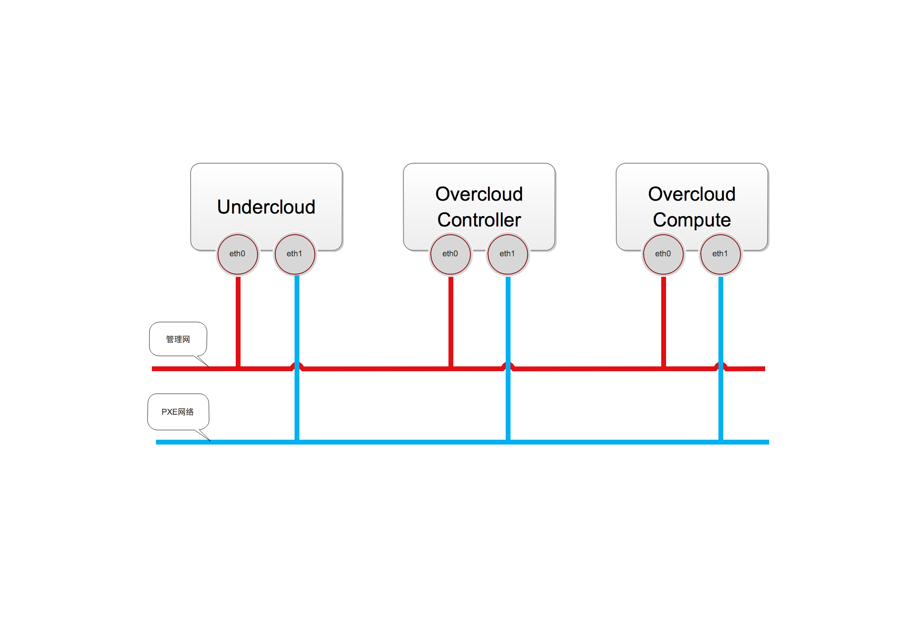

# TripleO

## 一、TripleO简介
TripleO 又叫 OpenStack on OpenStack，是一个用OpenStack来部署、升级和管理OpenStack的工具。
TripleO里面有两个主要部分：Undercloud和Overcloud，使用TripleO，你需要先创建一个小的OpenStack环境，称为:Undercloud，它包含了Heat、Ironic、Horizen、Keystone、Neutron等项目，TripleO使用Ironic做裸机管理，Heat做编排，Keystone做用户管理等，使用Undercloud部署出来的是正式的OpenStack环境：Overcloud。

## 二、TripleO部署需求
### 硬件需求
部署TripleO至少需要3个节点，角色分别如下：
- 一个Undercloud节点
- 一个Overcloud控制节点
- 一个Overcloud计算节点

最小配置：
- 多核CPU
- 8G 内存
- 60G 硬盘

推荐使用物理机，开发测试也可以使用虚拟机，TripleO部署目前只支持RHEL 7.1 x86_64和CentOS 7 x86_64。

### 网络需求
> 注：此网络需求不包含Overcloud中OpenStack所需网络。
- Overcloud服务器需要配置好IPMI。
- 一个管理网卡，用于管理Undercloud和Overcloud。
- 一块用于PXE的网卡，这个网卡在Overcloud中需要是同一名称的网卡，如em2，这个名称将会在安装配置的LOCAL_INTERFACE参数中使用，并且不能和管理网络是同一块网卡。
- 在BIOS中，把用于PXE的网卡放到引导顺序的第一位，并且关闭除了PXE网卡之外所有网卡的网络启动选项。
- 收集所有Overcloud节点的用于PXE引导网卡的MAC地址和IPMI信息。

网络参考下图：


TripleO提供了一个工具[tripleo-validations](https://github.com/openstack/tripleo-validations)用于检测TripleO部署可能出现的问题，该工具基于Ansible和Python编写，在validations目录下提供了很多检测的内容，如：
- NTP配置
- DHCP获取
- Pacemaker状态
- Undercloud硬件配置
- MySQL打开连接数限制
- ……

## 三、部署TripleO
由于TripleO也是一套小型的OpenStack环境，部署起来也较繁琐，于是出现了几个项目用来部署TripleO，如：[Tripleo-Quickstart](https://github.com/openstack/tripleo-quickstart)和官方推荐项目[Instack-Undercloud](https://github.com/openstack/instack-undercloud)。
其中,Tripleo-Quickstart主要使用Ansible部署、Instack-Undercloud则混合使用了脚本和Puppet来部署，但是使用Puppet的时候有些调用模块的时候会出问题，调用的资源改名时Instack-Undercloud里没有修改，所以在使用Instack-Undercloud部署TripleO的时候最好了解一些Puppet知识。
另外，由于使用RDO的源要下载很多包，网速慢的同学就要痛苦了，可能要部署很长时间。

## 四、TripleO部署OpenStack
### 1. 生成镜像
TripleO部署需要如下几个镜像：
```
ironic-python-agent.initramfs
ironic-python-agent.kernel
overcloud-full.initrd
overcloud-full.qcow2
overcloud-full.vmlinuz
```
> 注：如果只是测试的话也可以从CentOS网站上[下载](https://buildlogs.centos.org/centos/7/cloud/x86_64/tripleo_images/)

如果使用的是CentOS系统，可以直接使用以下命令创建：`openstack overcloud image build`，而如果是RHEL系统，则需要通过`--config-file`参数进行指定配置文件，
`openstack overcloud image build --config-file /usr/share/openstack-tripleo-common/image-yaml/overcloud-images.yaml --config-file $OS_YAML`
> 注：image-yaml目录是在5.0版本后才有的，Mitaka版本装的是2.1.1版本，并没有这个目录。

### 2. 上传镜像
使用如下命令上传镜像`openstack overcloud image upload`,更新镜像使用`openstack overcloud image upload --update-existing`，如果上传的是.initramfs后缀的镜像，需要执行以下命令重新配置Ironic使用这个镜像.
`openstack overcloud node configure --all-manageable`
### 3. 注册节点
注册节点是注册到Ironic里面，我们在前面提过，TripleO使用Ironic管理裸机，
`openstack overcloud node import instackenv.json`，使用的文件可以是JSON、YAML或CSV文件，导入时根据后缀名判断，该JSON文件模板如下：
```
{
    "nodes": [
        {
            "pm_type":"pxe_ipmitool",
            "mac":[
                "fa:16:3e:2a:0e:36"
            ],
            "cpu":"2",
            "memory":"4096",
            "disk":"40",
            "arch":"x86_64",
            "pm_user":"admin",
            "pm_password":"password",
            "pm_addr":"10.0.0.8"
        },
       ……省略两个节点
    ]
}
```
该命令只会导入信息，不会进行检查，导入后状态为：manageable，Ironic中服务器的状态有以下几种：
- enroll，该状态是Ironic不会对其进行管理，在Newton版本后，支持使用该状态替换available状态，即导入时添加`--initial-state=enroll`参数。
- manageable，验证完IPMI等可用后，服务器被设置为manageable状态，在这个状态时，用户可以进行自检、RAID配置等操作，但还不能开始部署。
- available，部署前的最后一个状态，此状态时Ironic可以随时开始部署。

如果要在导入时进行检查，则执行以下命令：
`openstack overcloud node import --introspect --provide instackenv.json`
### 4. 节点自检
上节说过，在manageable状态时，用户可以执行自检程序，命令如下:
Mitaka版本中则是使用`openstack baremetal introspection bulk start`，之后的版本使用：
`openstack overcloud node introspect --all-manageable`，如果只需要检查一个节点可以先把该节点置为manageable状态，然后执行检查:
```
ironic node-set-provision-state UUID manage
openstack baremetal introspection start UUID
```
然后使用以下命令查看这台机器的状态，看其中的**finished**是否为**True**：
`openstack baremetal introspection status UUID`
### 5. 部署节点
使用`openstack overcloud deploy`命令部署，后面使用`—templates`指定的Heat模板，`-e`指定Heat环境文件，给Heat传递参数，由于TripleO使用Heat部署Overcloud，理所当然，你起码得了解Heat，知道该怎么用，附录中有Heat模板的连接，感兴趣的可以看一下，这里我们就不多做介绍了。
TripleO支持控制节点HA部署,至少需要3个节点通过Pacemaker实现HA功能，通过以下方式添加到deploy命令的后面：
```
# cat << EOF > ~/environment.yaml
parameter_defaults
  ControllerCount: 3
EOF

# openstack overcloud deploy -e environment.yaml -e /usr/share/openstack-tripleo-heat-templates/environments/puppet-pacemaker.yaml --ntp-server pool.ntp.org
```
### 6. 总结
#### 优点：
- 熟悉OpenStack的人使用方便
- 很好的管理物理服务器，完整的生命周期管理

#### 缺点
- 部署麻烦
- 上手较困难

### 参考
Heat模板：[https://docs.openstack.org/developer/heat/template_guide/index.html](https://docs.openstack.org/developer/heat/template_guide/index.html)
